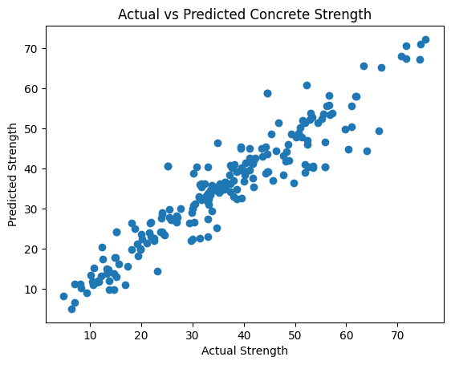

# Concrete Compressive Strength Prediction using Machine Learning

## 📌 Overview
This project predicts the compressive strength of concrete using 
Machine Learning (Random Forest Regressor), based on ingredients 
like cement, water, fly ash, superplasticizer, and curing age — 
eliminating the need to wait 28 days for lab testing.

## 📊 Dataset
UCI Machine Learning Repository - Concrete Compressive Strength Dataset
(1030 samples, 8 input features, 1 target variable)

## 🛠 Technologies Used
- Python
- Pandas, NumPy
- Scikit-learn
- Matplotlib

## 🤖 Model
Random Forest Regressor

## 📈 Results
Achieved R² Score of **0.88 (88% accuracy)** on test data

## 🚀 How to Run
1. Clone this repository
2. Open the `.ipynb` file in Google Colab or Jupyter Notebook
3. Run all cells in order

## 🎯 Future Scope
Can be converted into a web app for real-time use by site engineers 
to predict concrete strength without waiting for lab test results.
